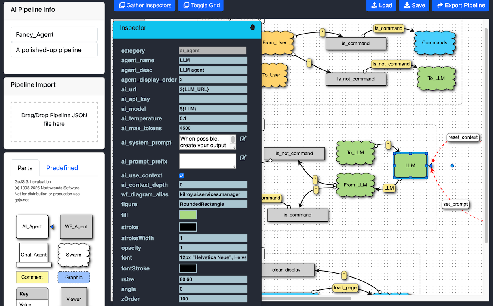
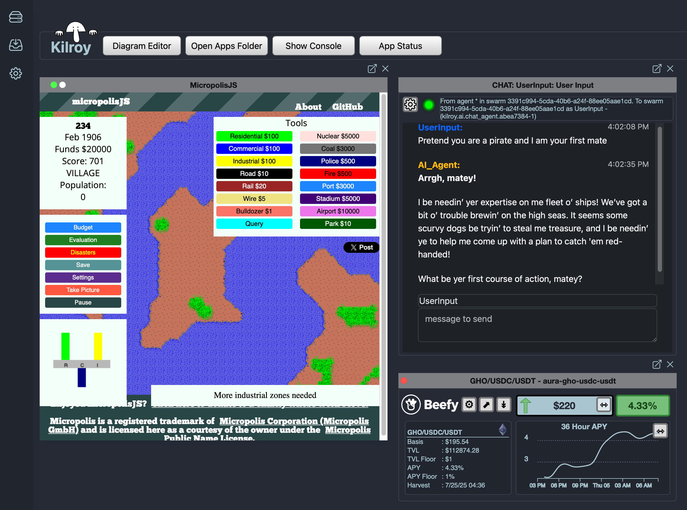

{ width=400 }

# \[Build the Future. No Code Required.\]

## About Kilroy

Kilroy empowers anyone to build, automate, launch, and share apps, AI solutions, and DeFi strategies -no code required- by making composable decentralized technology accessible for all. It's a single, double-clickable application that lets you control your apps, agents, and messages without the messy installation
of command line tools and dozens of scattered pieces.

{ align=right width=300 }
Kilroy is a desktop-first application that integrates all of your local applications with anything else on the Internet. It provides all of the
plumbing and runtime support to connect local AI agents with messaging services, cloud platforms, and remote Kilroy users. Based around the concept of
peer-to-peer swarms, Kilroy makes building and sharing your own version of the Internet possible. Collaborate with friends over private, end-to-end communications.
Connect to remote AI agents. Share your trading bots with others through online app stores. Monetize your creations with built-in markets, reputation rewards, and
the ability to make your applications available to anyone you'd like.

## Kilroy Uses

Out of the box, Kilroy comes with dozens of applications that are ready to use. Some include:

 - Full-featured, drag-and-drop AI agent pipeline creation, with local and remote agents, peer-to-peer collaboration, and support for dozens of tools and services 
 { align=right width=300 }
 - Desktop automation - tight integration with deep linking to apps on your desktop or laptop
 - Remote access to your Kilroy apps and agents via popular messaging apps like Telegram, Discord, and Whatsapp
 - Web widgets for collecting your favorite web sites and utilities into a personal dashboard

The options are endless, and anyone can create a new Kilroy app in minutes using the built-in visual editors, or native access to Javascript and your local 
operating system if you're a power user.

## Downloading and Installing Kilroy

Kilroy is a free application download for desktop and laptop computers, available for the following platforms:

- macOS on Apple Silicon
- Windows 11
- Linux (Ubuntu) --coming soon--
- Docker --available upon request--

## Getting Started

# Other Resources
 * [Github](https://github.com/kilroy-tech/)
 * [Kilroy Wiki](https://github.com/kilroy-tech/kilroy/wiki/Kilroy-Wiki)
 * [MkDocs-Material](https://squidfunk.github.io/mkdocs-material/)
 * [Kilroy Docs](https://docs.kilroy.tech/)
