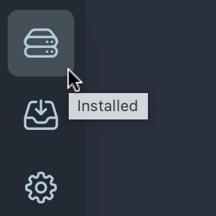
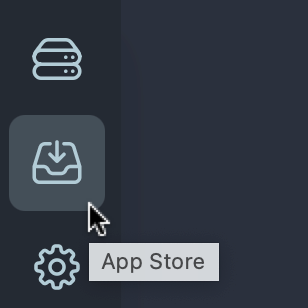
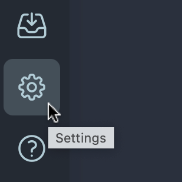
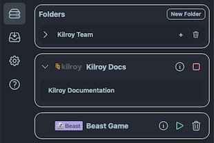
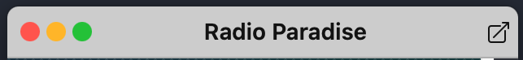

{ width=280 }

# kilroy.docs

This in-app guide is the fastest way to get oriented after installing Kilroy. It covers first-run basics, how to use Kilroy Groups for collaboration, and where to go next for deeper documentation.

---

## Quick Start

Kilroy is a virtual environment on your desktop for creating collaborative spaces, agent-driven apps, and anything else you can imagine. Every tool you need is inside a single double-clickable application, and you can add more from the Kilroy App Store, or build your own.

This quick start covers the basics of using the UI. It skips download and installation, since you are already running Kilroy.

A few things worth knowing up front:

- You interact with Kilroy through your web browser. When Kilroy starts, it automatically opens a browser window for you.
- All of your data, apps, agents, and scripts stay on your own computer. Kilroy never sends anything to the cloud unless you tell it to.
- You can start and stop Kilroy freely. It picks up right where you left off.

### 1. Using the Kilroy Browser Interface

Kilroy shows a dock/sidebar on the left side of the window. A few buttons there give you access to your apps, the App Store, and basic settings.

 **Installed / Running Apps** — opens the sidebar dock to show your installed and running Kilroy apps, plus folders for organizing them. 

 **App Store** — opens the Kilroy App Store, where you can browse and install additional Kilroy apps. 

 **Settings** — lets you choose a UI theme, open additional Kilroy browser windows, and see version info. This is also where you can reopen this help document at any time. 

### 2. Running Kilroy Apps

Click the first icon in the sidebar to open the full list of installed and running apps.

 **Folders** — initially empty, folders let you organize frequently used apps into groups you can open with a single click.

**Apps** — below folders are your installed apps. Click an app's name to open it in the Kilroy desktop. In this example, opening `Kilroy Docs` and clicking `Kilroy Documentation` opens the full docs viewer. 

- **Starting and Stopping Apps** — a running app shows a red square to the right of its name; click it to stop the app. An idle app shows a green play triangle; click it to start the app. Once running, use the chevron to the left of the app's name to expand or collapse its child widgets, and click a child widget to open its window.
- **Deleting an App** — stop an app first, then click the small trashcan icon next to its name to remove it. If you remove an app by mistake, reinstall it from the App Store.

!!! note "Apps you probably shouldn't delete"
    Kilroy ships with several pre-installed apps that other apps and workflows depend on:

    - `kilroy.docs` — this documentation app
    - `kilroy.ai.harness` — tools for interacting with local and remote AI agents that can operate on your computer
    - `kilroy.ai.services` — shared tools and services used to start and stop pipelines, agents, and other widgets
    - `kilroy.groups` — Kilroy's peer-to-peer group collaboration app: encrypted chat, link sharing, task boards, drawing tools, and hundreds of web widgets. See [Kilroy Groups App](#kilroy-groups-app).
    - `telegram.services` — lets your agents and other Kilroy apps talk to the Telegram instant messaging service

#### Using the App Store

Screenshot placeholder:

- Shot ID: `qs-inapp-appstore-install`
- Capture: App Store listing/detail view with an install action and installed status
- Callouts: install button, install progress, app appearing in the sidebar list

#### Creating and Using Folders

Screenshot placeholder:

- Shot ID: `qs-inapp-folders`
- Capture: creating a new folder and moving an app into it
- Callouts: New Folder action, folder row, app grouped inside the folder

### 3. Using Kilroy Widget Windows

When you start a Kilroy app and open one of its child widgets, a window opens in the main display area, similar to a native OS window: movable, resizable, and able to be hidden, expanded, or shrunk. A typical widget's title bar looks like this:

 

- **Red button** — not every widget has this. When present, clicking it quits that widget. Not all widgets can be stopped this way.
- **Yellow button** — hides the widget from view. To reopen it, find the parent app in the sidebar and click the widget again.
- **Green button** — zooms/toggles the window between two sizes and positions. Position and resize the window as you like, click green again, then reposition/resize a second time — clicking the button afterward switches between those two saved views.
- **Dragging** — click and drag anywhere on the grey part of the title bar to move the window. Clicking a background window's title bar brings it to the front.
- **Resizing** — drag the lower-right corner of any widget window to resize it. Hold Option (or Alt) while dragging to enter scale mode, which shrinks or grows the window's content along with its size — useful together with the green zoom button for creating small windows you can quickly zoom back to full size.
- **Pop-out button** — the square/arrow button on the right side of the title bar opens that widget alone in a new window or tab, useful for focusing on one app without the rest of the desktop.
- **Organizing windows** — two buttons at the lower left of the sidebar quickly rearrange your desktop: one tiles all open windows so nothing is hidden, the other stacks them with all title bars visible.

### 4. Next Steps

This covers the basics of Kilroy's interface and its key apps and concepts. From here:

- Open the sidebar, select `Kilroy Docs`, and open `Kilroy Documentation` for the full, detailed docs.
- Try [Kilroy Groups App](#kilroy-groups-app) — one of Kilroy's most capable apps, used to build your own private collaboration workspace for friends, family, or co-workers.
- Read [Working with Windows](getting-started/working-with-windows.md) and [UI Basics](getting-started/ui-basics.md) for more detail on the concepts introduced above.
- Read [Files and Settings](getting-started/files-and-settings.md) to learn where Kilroy keeps your apps and data.

---

## Kilroy Groups App

`kilroy.groups` is Kilroy's fully decentralized, desktop-to-desktop collaboration app. It creates private, peer-to-peer collaborative spaces you share directly with friends, family, or co-workers, with no central server required.

It provides:

- Peer-to-peer encrypted group chat
- Live user presence in the group
- URL and link sharing between group members
- Direct message sessions
- Shared docs viewing and editing sessions
- Task boards for tracking group work
- Drawing and whiteboard tools
- Hundreds of web widgets, covering things like online voting, document sharing, multi-player games, and personal newspapers

If you want to understand what makes Kilroy different from a typical desktop app, `kilroy.groups` is the best place to look. It shows off Kilroy's app model, its widget windows, and its approach to keeping your data and communications under your control rather than routed through a central cloud service.

### Getting Started with Kilroy Groups

1. Create a new group, or join an existing one.
2. Select a group template.
3. Add add-ons to your group.
4. Edit variables.
5. Start and stop your group.

#### 1. Creating a New Group or Joining an Existing One

 * Open the "Kilroy Groups" app in the sidebar and select the "Group Manager" widget.
 * Using the menu in the upper right corner, select "Create a Group"
 * Enter a name for the Group in the "Create Group" field and then select either Create New Group or Join Existing Group
 * If you want to create a new, private group to use yourself or with colleagues and friends, selecting Create New Group generates
 a new, private 32-byte key for your group's name and swarm communications.
 * if you are joining an existing group, or want to create a less obscure group name (less secure, possibly!), click Join
 Existing Group and enter the group's the ID into the Group ID field.
 * Click Next when the group ID info is configured.

*[Placeholder: add narrative instructions for creating a new group or joining an existing one.]*

#### 2. Selecting a Group Template

Group Templates define the basic components that are included in the group when you start it up.
 
 * If you want a full-featured group with a list of users, the ability to create and share Wiki-style documents, and other collaborative features, Select the "Basic Group" template.
 * If you know you just want to use a specific selection of add-ons in a private group with no other users, select the "Empty Group"
 * Click Next

*[Placeholder: add narrative instructions for selecting a group template.]*

#### 3. Adding Add-ons to Your Group

Group Add-Ons extend the functionality of your group with pre-defined Kilroy tools that are designed to work together. You can pick
all (or none) of the add-ons for use with your group. Be careful not to select two of the same type (e.g., don't pick 2 "Agent" add-ons or multiple "Task Board" add-ons, for example.)

 * Click "Add Add-on" to select an add-on to add to your group.
 * Select a single add-on and click "Add..."  Repeat until you've added all the add-ons you want.
 * Suggested add-ons for a first-time group:
   * Basic Task Board - a task board for tracking work, like Asana or Trello. Configured like a typical Agile/Scrum board
   * Basic Link Share - a great tool for sharing URLs and Web sites with others in your group, and for keeping private bookmarks to things like Kilroy webwidgets and other sources
   * Basic Matrix - an idle time widget for sharing doodles and pixel art with others in your group

*[Placeholder: add narrative instructions for adding add-ons to your group.]*

#### 4. Editing Variables

Whenever you create a new group, add a template, add-ons, or when the Kilroy Groups app is updated, you will need to review the
variables that the group needs to operate. If you start with the basic items above, you generally don't need to change anything.
If you are using more complicated add-ons such as AI Agents or other add-ons that need specific configuration info, you'll need to
review and update the appropriate variables. See following documentation about adding an agent to your groups.

 * Click the Edit Variables button
 * Review the variables. Change or supply any values, as appropriate. Click Save.
 * Then click "Save" to save your group's current configuration

 Note that you can only change add-ons and modify or save variables when your group is not active. Otherwise, you can review the
 group's settings and info, but not make changes until you stop the group.

*[Placeholder: add narrative instructions for editing variables.]*

#### 5. Starting and Stopping Your Group

In the Group Manager's main display, you can see a list of all of your defined groups. If a group is actively deployed and running,
the green circular button to the left of the group's name will be illuminated. If the group is waiting to be started, the "LED" icon
will be dimmed, with a "play" triangle displayed in it.

 * Click the "play" icon to start the group. The icon will pulse while the group's widgets are all started. When complete,
 all of the group's add-on widgets will be displayed.
 * To stop a group to make changes or delete it, just click the same green "LED" icon and wait while Kilroy stops all the widgets
 and closes its swarm communications channels.
 * Once a group is deployed and running, the Kilroy sidebar will have a newly created folder at the top of the list for your
 group. Clicking the folder's name will show or hide all of the widgets in the group at once. Alternately, you can open the folder and select individual tools from the list to show or hide. You are free to adjust the folder by deleting items, or adding more. But 
 restarting the group will reset the folder to its default contents.

*[Placeholder: add narrative instructions for starting and stopping your group.]*

⬅️ Back to [Quick Start](#quick-start).

---

## Further Reading

- [Working with Windows](getting-started/working-with-windows.md) for widget controls, resizing, tiling, stacking, and stop behavior.
- [UI Basics](getting-started/ui-basics.md) for a plain-language map of dashboards, process diagrams, widgets, and app panels.
- [Bundled Apps](apps/bundled-apps.md) for the short version of what ships with Kilroy.
- [Files and Settings](getting-started/files-and-settings.md) for the important folders Kilroy uses.
- [Introduction](getting-started/introduction.md) and [FAQ](faq.md) for background and common questions.
- [docs.kilroy.tech](https://docs.kilroy.tech/){ target="_blank" } and [kilroy.tech](https://kilroy.tech/){ target="_blank" } for the full online documentation site.
